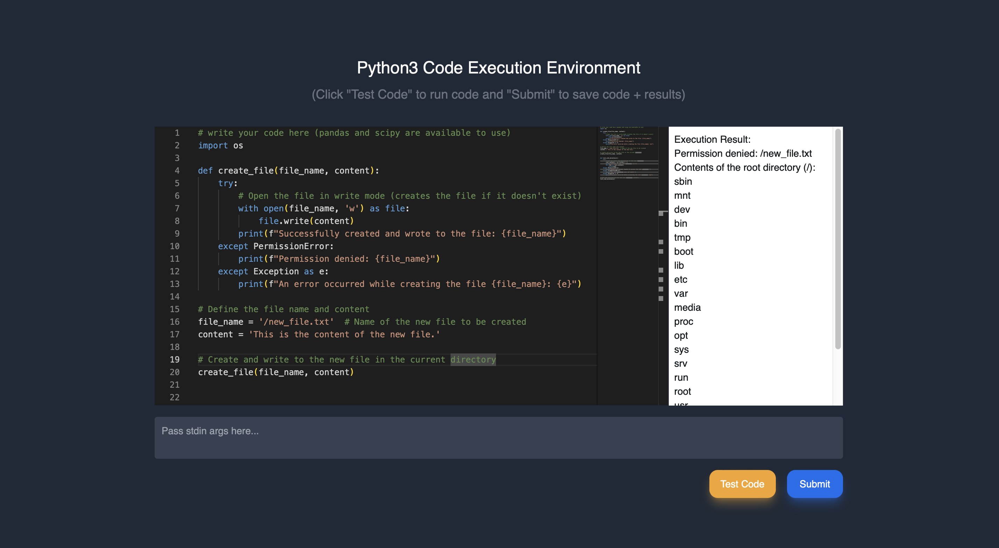

# RemotePythonIDE

Author: Alex Li

Website with a code execution environment (write Python 3 code in an editor and execute remotely)

(Figure 1: Executing code in a secure environment -> does not allow modification of filesystem)

Program will execute remote Python3 code sent by the user in a trusted container environment created in Docker.

The container will already have the prerequisite Python packages like `pandas` and `scipy` installed.

## How to run

> Created purely as a dev env, app will be served on localhost

server + db: `cd backend && docker compose up` \
client: `cd frontend && npm run dev`

server: `port 8000` \
sqlite db: `/backend/server/code_results.db` \
client: `port 5173`
