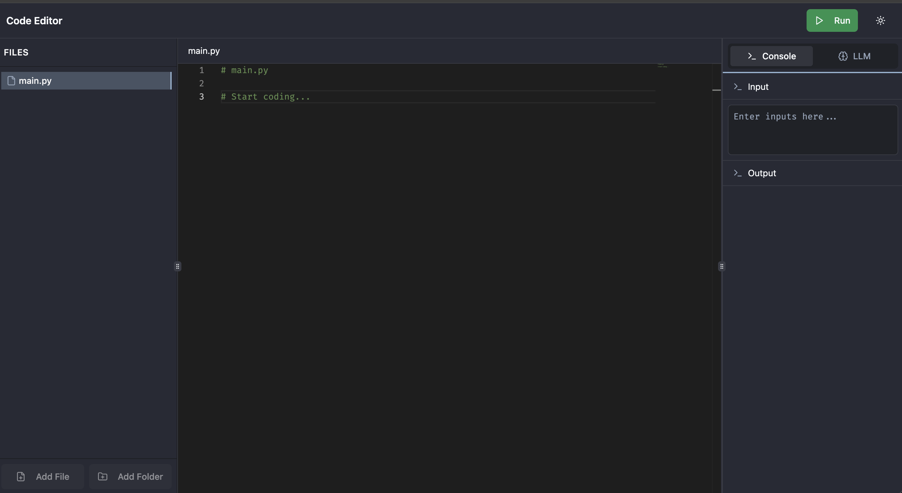

# ApeironDev 

 <!-- Replace with your actual GitHub username -->

A web-based IDE that allows users to write, execute, and view results of code remotely. This project features a secure, containerized execution environment, real-time updates, user authentication, **AI-powered code assistance**, and a **robust, highly scalable microservices** backend built on Google Cloud Platform.

*(Figure 1: The IDE in action, showcasing code editing, execution, and output.)*

## ✨ Core Features

*   **Interactive Code Editor**: Leverages the Monaco Editor for a rich and responsive coding experience.
*   **Remote Python 3 Execution**: Executes code securely in a sandboxed Google Cloud Run environment, providing a reliable and isolated workspace.
*   **AI Code Assistant**: Intelligent chat interface with contextual awareness of your codebase, powered by RAG (Retrieval-Augmented Generation) and LangGraph connected agents.
*   **Collaborative Workspaces**: Multi-user workspace sharing with real-time file synchronization and conflict resolution using Two-Phase Commit protocol.
*   **User Authentication**: Integrated with Clerk for seamless and secure sign-up, sign-in, and user session management.
*   **Real-time Job Updates**: Utilizes Firestore real-time listeners to provide instant feedback on code execution status and results directly in the UI.
*   **Asynchronous Task Queuing**: Employs Google Cloud Tasks to efficiently manage and process code execution jobs, ensuring smooth performance.
*   **Secure by Design**:
    *   The Python worker service operates with least-privilege non-root access in a designated temporary directory.
    *   Leverages secure OIDC tokens for service-to-service communication within the Google Cloud ecosystem.
    *   Firestore security rules are in place to protect data integrity and access.
*   **Infrastructure as Code**: Google Cloud resources are provisioned and managed declaratively using Terraform.
*   **Scalable Cloud Architecture**: Built with serverless components like Cloud Run and Cloud Tasks, designed for scalability.

## 🛠️ Tech Stack

**Frontend:**
*   React (with Vite) & TypeScript
*   Tailwind CSS & Shadcn/ui
*   Monaco Editor
*   Clerk (Authentication)
*   Firebase SDK (Firestore real-time)
*   React Router

**Backend: (Microservices Architecture)**
*   **Google Cloud Run Services**
    *   **API Service** (`api-service`): Go - Main orchestration layer
    *   **Python Worker Service** (`python-worker-service`): Python (FastAPI) - Code execution engine
    *   **RAG Indexing Service** (`rag-indexing-service`): Python (FastAPI) - Workspace vectorization
    *   **RAG Query Service** (`rag-query-service`): Python (FastAPI) - AI-powered code assistance
*   **Database**: Google Cloud Firestore to handle Job and Filesystem metadata
*   **Storage**: Cloudflare R2 (S3-compatible) for workspace files and vector databases
*   **Vector Database**: LanceDB for semantic code search
*   **Task Queue**: Google Cloud Tasks
*   **AI/ML**: Google Gemini for embeddings and language models

**Cloud & DevOps:**
*   Google Cloud Platform (GCP): Cloud Run, Cloud Tasks, Cloud Firestore, Cloud Build CI/CD with Github Integration and Triggers, IAM, GCS, Metrics Explore, Logs Explorer
*   Terraform (Infrastructure as Code)
*   Docker

## ⚙️ Project Architecture Flow

**Code Execution Flow:**
1.  **Code Entry** (Frontend): User writes code in the browser.
2.  **API Request** (Frontend → API Service): Code is sent to the Go-based `api-service`.
3.  **Job Creation & Queuing** (API Service):
    *   A job record is created in Firestore.
    *   An execution task is enqueued to Google Cloud Tasks.
4.  **Task Execution** (Cloud Tasks → Python Worker):
    *   The Python `python-worker-service` (FastAPI) picks up the task.
    *   Job status is updated to "processing" in Firestore.
    *   Code runs in a sandboxed, resource-limited environment.
    *   Results (output/errors) are saved to Firestore.
5.  **Real-time Results** (Firestore → Frontend): The UI updates instantly with job status and output via Firestore listeners.

**AI Assistant Flow:**
1.  **Workspace Indexing**: After each workspace sync, files are automatically vectorized and stored in LanceDB.
2.  **Query Processing**: User chat queries trigger a LangGraph agent that intelligently decides between:
    *   Codebase search (hybrid vector + keyword search over workspace files)
    *   Web search (public Internet search for general programming knowledge)
3.  **Context Generation**: Retrieved information is summarized and fed to the language model for accurate, context-aware responses.

**Authentication**: Clerk manages user identity across the frontend and is verifiable by the backend.

## 🛡️ Security Highlights

*   **Sandboxed Execution**: Code execution is isolated within Docker containers on Cloud Run with strict resource limits.
*   **Firestore Rules**: Database access is controlled via Firestore security rules, with client-side writes disabled and server-side operations managed by IAM-authenticated services.
*   **OIDC Authentication**: Secure, token-based authentication is used for inter-service communication within GCP (e.g., Cloud Tasks invoking Cloud Run).

